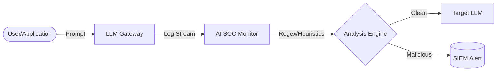

# GenAI SOC Toolkit

A suite of defensive engineering tools designed to integrate Large Language Model (LLM) telemetry into traditional Security Operations Center (SOC) workflows. 

## Capabilities
- **LLM Gateway Monitor:** Ingests AI API logs (e.g., OpenAI, Anthropic, local vLLM) and applies deterministic heuristics and regex to identify prompt injection attacks, Jailbreaks, and PII exfiltration.
- **SIEM Integration:** Outputs structured JSON optimized for Splunk, Elastic, and Sentinel.

## Architecture

